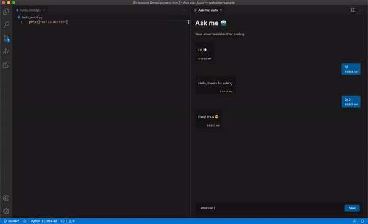

# Welcome to Ask me 🤖
> Your smart assistant for coding

    

Made with ❤️ for #VSCodeHackathon 2020

## Microservices
- Api base: https://ask-me-api.herokuapp.com (Fetch question data)
- Math.js: http://api.mathjs.org/v4/
- NLP API: https://simple-bot-hackaton.herokuapp.com/bot-response

## How to run?
Run `npm install` and go!

## Contributors
<table>
  <tr>
    <td align="center">
      <a href="https://github.com/sjdonado">
         <b>Juan Rodriguez</b>
      </a>
    </td>
    <td align="center">
      <a href="https://github.com/krthr">
         <b>Wilson Tovar</b>
      </a>
      </td>
    <td align="center">
      <a href="https://github.com/ManuLasker">
         <b>Emanuel Afanador</b>
      </a>
    </td>
  </tr>
<table>